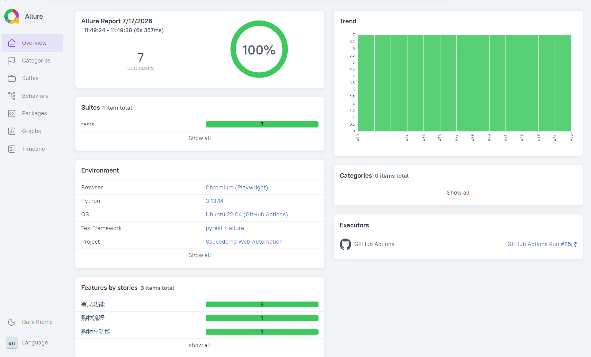
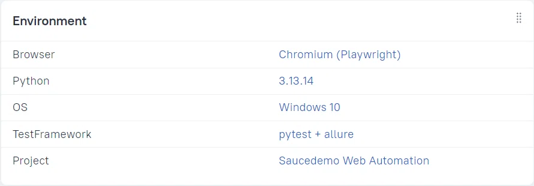
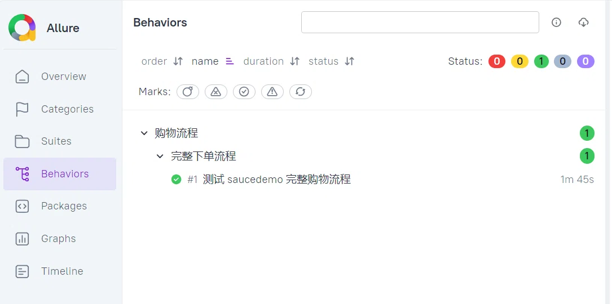
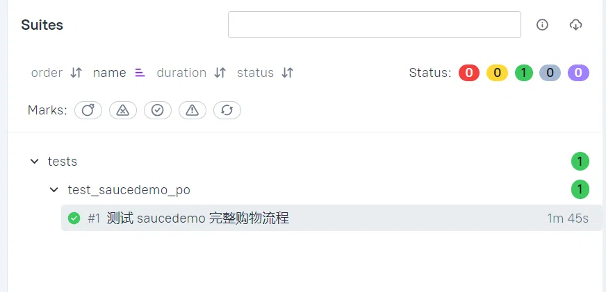
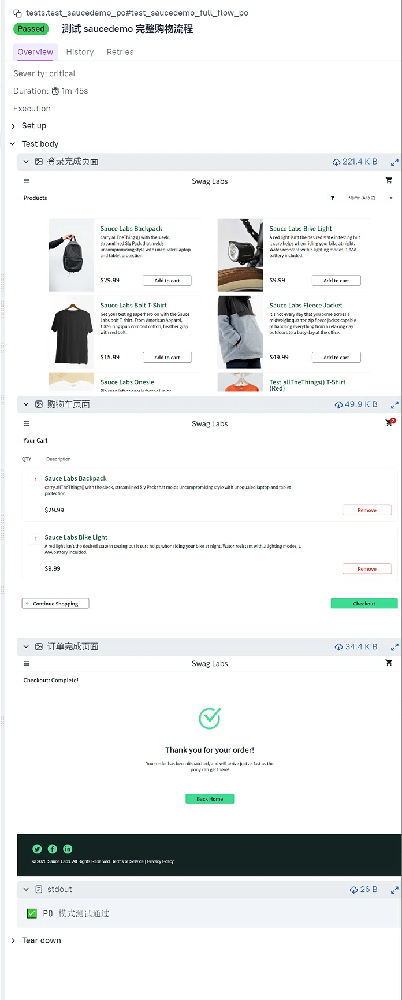

# Saucedemo Web 自动化测试项目

> 基于 Python + Playwright + pytest + Allure 的 Web 自动化测试项目，使用 Page Object Model（PO）模式封装页面对象，对 SauceDemo 电商网站完成完整购物流程自动化测试。

## ✨ 项目特点

- **Page Object Model**：页面元素与业务逻辑分离，代码结构清晰，易于维护和扩展
- **Playwright**：现代化的 Web 自动化测试框架，支持多浏览器、自动等待
- **pytest**：灵活的测试用例管理与执行
- **Allure 报告**：专业的测试报告，含 Environment 环境信息、步骤截图、分类展示
- **数据驱动**：测试数据集中管理在 config.json 中，支持多环境快速切换
- **日志系统**：测试执行过程自动记录日志，便于问题追溯
- **持续集成**：GitHub Actions 自动运行测试，每次代码提交自动触发

## 🛠️ 技术栈

- Python 3.13
- Playwright
- pytest
- allure-pytest
- Allure 命令行工具
- GitHub Actions

## 📁 项目结构

```text
第三周_web_auto_po/
├── config/
│   └── config.json              # 测试数据配置
├── pages/
│   ├── cart_page.py             # 购物车及结算页面对象
│   ├── inventory_page.py        # 商品列表页面对象
│   └── login_page.py            # 登录页面对象
├── tests/
│   └── test_saucedemo_po.py     # PO 模式测试用例（7条）
├── performance/
│   └── locustfile.py            # Locust 性能测试脚本
├── images/
│   ├── allure_overview.png      # Allure 报告概览截图
│   ├── allure_environment.png   # Allure 环境信息截图
│   ├── allure_behaviors.png     # Allure Behaviors 截图
│   ├── allure_suites.png        # Allure Suites 截图
│   ├── allure_test_detail.png   # Allure 用例详情截图
│   └── locust_test.png          # Locust 压测截图
├── .github/
│   └── workflows/
│       └── ci.yml               # GitHub Actions CI 配置
├── conftest.py                  # pytest fixture + 日志 + 配置加载
├── environment.properties       # Allure 环境信息
├── requirements.txt             # 项目依赖
└── README.md
```

## 📋 测试流程

测试用例覆盖了完整的购物流程：

1. 登录（standard_user）
2. 添加商品到购物车
3. 进入购物车并校验商品数量
4. 填写收货信息
5. 提取订单总价并校验
6. 完成订单并验证成功

### 测试覆盖

| 测试场景 | 用例数 | 说明 |
|----------|--------|------|
| 完整购物流程 | 1 | 登录 → 加购 → 结算 → 完成订单 |
| 锁定用户登录 | 1 | 验证 locked_out_user 登录失败并提示 |
| 问题用户登录 | 1 | 验证 problem_user 登录后页面展示异常 |
| 空购物车结算 | 1 | 空购物车进入结算页面 |
| 多用户参数化登录 | 3 | 覆盖 standard_user、locked_out_user、problem_user |
| **总计** | **7** | 全部通过 ✅ |

## 🚀 运行方式

### 1. 安装全局依赖

项目基于Python，先一次性安装自动化+性能测试全部依赖
```bash
pip install -r requirements.txt
# 安装Playwright浏览器驱动
playwright install

### 2. 运行自动化测试

```bash
pytest tests/test_saucedemo_po.py -v --alluredir=./allure-results --clean-alluredir

### 3. 查看 Allure 报告

**本地查看**

```bash
allure serve ./allure-results

**在线查看**

📊 [查看 Allure 测试报告](https://stillstream-ink.github.io/software-testing-notes/allure-report/)



⚠️ Allure 报告必须通过 allure serve 命令打开，不能直接双击 HTML 文件。


## ⚡ 性能测试

项目使用 Locust 进行简单的性能测试。

```bash
# 安装 Locust
pip install locust

# 启动压测
cd 第三周_web_auto_po
locust -f performance/locustfile.py --host=https://www.saucedemo.com

然后访问 http://localhost:8089，设置并发用户数（如 10 个），点击 Start 开始压测。


## 📊 测试报告截图

**在线查看**

📊 [查看 Allure 测试报告](https://stillstream-ink.github.io/software-testing-notes/allure-report/)


### Environment



### Behaviors



### Suites



### 用例详情




## 📝 项目说明

该项目是 Web 自动化测试学习的产出，旨在展示：

从零搭建 Playwright 自动化测试环境

PO 模式封装页面对象的设计思路

结合 pytest + Allure 生成专业测试报告

数据驱动 + 日志系统的工程化实践

GitHub Actions 持续集成自动运行测试

该测试项目基于 SauceDemo 演示网站 (https://www.saucedemo.com) 构建，仅用于学习与作品展示。
